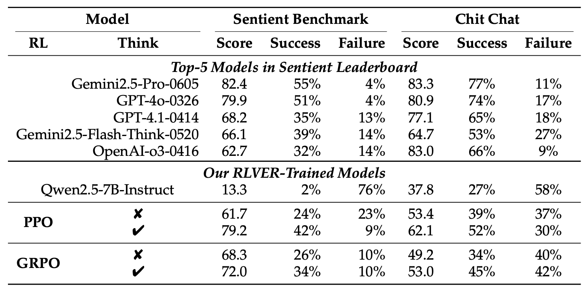

<h1 align="center"> RLVER: Reinforcement Learning with Verifiable
Emotion Rewards for Empathetic Agents </a></h2>


<h5 align="center">


</h5>

This is the official implementation of the following paper:

> **RLVER: Reinforcement Learning with Verifiable
Emotion Rewards for Empathetic Agents** 

<p align="center"></p>
<p align="center"><em>The overview of RLVER. In this work, we present the first end-to-end reinforcement-learning framework that equips
an LLM with human-level empathetic skills by optimizing against verifiable emotion
rewards.</em></p>

<p align="center"></p>
<p align="center"><em>The main result of RLVER.</em></p>


## 1. Environment Setup 🔧

```
pip install -r requirements.txt
```
This project uses Ray and Verl frameworks. You should configure your settings in `train_rlver.sh` before the training.
## 2. Data  📚
The training and test user profiles are provided in `data/test_profile.jsonl`.

## 3. Start Training 🔥
1. **Basic Settings**
Set the data path, model path, and other configurations.
To enable "Think then say" mode during training, set `IF_THINK=True`.
To use GRPO, set `algorithm.adv_estimator=grpo` and `actor_rollout_ref.rollout.n=4`.
2. **Set up RAY**
Firt set up the RAY environment.
```
# On chief node:
ray start --head --port=$PORT_ID --node-ip-address=$CHIEF_IP

# On each worker node:
ray start --address=$CHIEF_IP:$PORT_ID --node-ip-address=$CURRENT_IP
```
3. **Start training**
Now you can run `train_rlver.sh` to start training!
```
sh ./train_rlver.sh
```

## 6. Evaluation 🏆
To evaluate your trained model:
1. **Convert to Hugging Face format**:
```
sh ./mk_hf_model.sh
```
2. **Evaluate with SAGE**
You can evaluate the converted model following the instructions in [SAGE](https://github.com/Tencent/digitalhuman/tree/main/SAGE).


