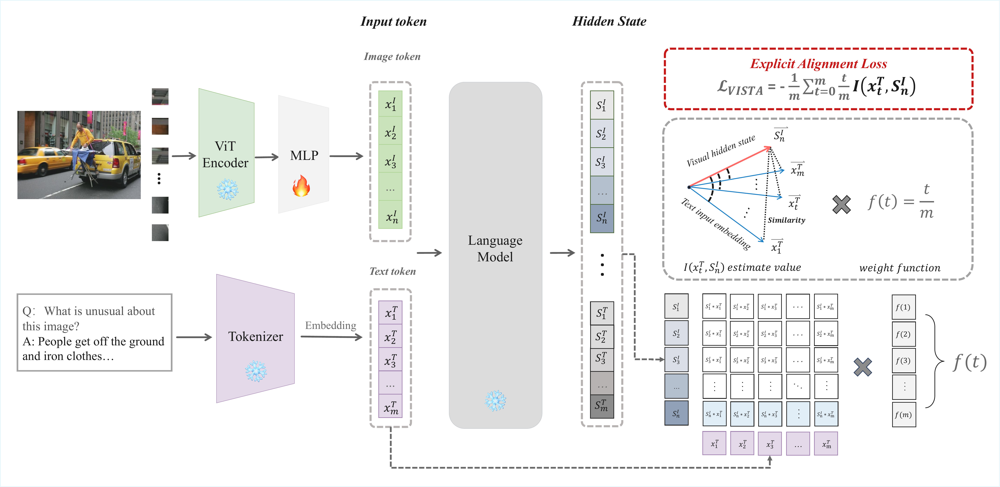

# 🌟 VISTA: Enhancing Vision-Text Alignment in MLLMs via Cross-Modal Mutual Information Maximization

[](https://arxiv.org/abs/2505.10917)
[](LICENSE)
[](http://your-demo-url)



## 📝 Project Introduction

VISTA (Vision-Text Alignment) is an innovative alignment method for Multimodal Large Language Models (MLLMs) that addresses the prevalent modality alignment issues in current MLLMs. Through an in-depth analysis of the information-theoretic properties of traditional cross-entropy loss, we discovered that existing implicit alignment mechanisms degrade with increasing text sequence length, leading to diminished importance of visual information in semantic understanding.

The core innovation of VISTA lies in introducing an explicit cross-modal mutual information maximization objective, effectively addressing the following key issues:

- **Modality Imbalance**: Traditional MLLMs often overemphasize textual information while neglecting the importance of visual context
- **Insufficient Implicit Alignment**: Existing cross-entropy loss lacks explicit constraints for visual-text semantic consistency
- **Sequence Length Dependency**: Visual information contribution diminishes as text sequence length increases

## 🎉 News
* **[2025.06]** VISTA paper released
* **[2025.06]** VISTA codebase open-sourced

## 🎉 Key Features

### Theoretical Innovation
- First analysis of cross-entropy loss in MLLMs from an information-theoretic perspective
- Revealed theoretical reasons for the degradation of implicit alignment mechanisms with increasing text sequence length
- Proposed explicit alignment objective based on mutual information maximization

### Technical Innovation
- No additional trainable modules or architectural modifications required
- No additional training data or training phases needed
- Seamless integration with existing MLLM training processes
- Support for various visual encoders and language models

### Performance Improvements
Significant improvements across multiple benchmarks:

#### Advanced Semantic VQA Tasks
- VQA-v2: +0.56%
- OK-VQA: +2.86%
- GQA: +0.55%
- TextVQA: +0.56%
- RealWordQA: +2.8%
- DocVQA: +1.17%

#### General Visual Tasks
- SEEDB-I: +0.51%
- AI2D: +1.9%
- MMMU: +0.78%
- MMStar: +7.17%
- MMTB: +0.13%
- MMBench-en: +1.06%
- MMBench-cn: +1.52%

#### Fine-grained Visual Tasks
- MME-PERCEPTION: +3.98%
- MME-COGNITION: +8.5%
- RefCOCO: +2.41%
- RefCOCO+: +2.62%
- RefCOCOg: +0.71%

### Implementation Advantages
- Clean and modular code implementation
- Easy to extend and reproduce
- Support for various model architectures

## 📋 Table of Contents
- [Installation](#installation)
  - [Requirements](#requirements)
  - [Quick Installation](#quick-installation)
- [Data Preparation](#data-preparation)
  - [Pre-training Data](#pre-training-data)
  - [Instruction Fine-tuning Data](#instruction-fine-tuning-data)
- [Training](#training)
  - [Pre-training](#pre-training)
  - [Instruction Fine-tuning](#instruction-fine-tuning)
- [Evaluation](#evaluation)
  - [Benchmarks](#benchmarks)
  - [Evaluation Scripts](#evaluation-scripts)
- [Model Zoo](#model-zoo)
  - [Pre-trained Models](#pre-trained-models)
  - [Fine-tuned Models](#fine-tuned-models)
- [Citation](#citation)
- [Acknowledgments](#acknowledgments)
- [License](#license)

## Installation

### Requirements
- Python 3.10+
- CUDA 11.7+ (for GPU training)
- At least 16GB GPU memory (for training)
- At least 8GB GPU memory (for inference)

### Quick Installation

VISTA provides two implementations: LLaVA-VISTA and TinyLLaVA-VISTA. Please choose the appropriate directory for installation and training based on the model version you want to train.

#### LLaVA-VISTA
```bash
cd LLaVA-VISTA
conda create -n llava python=3.10 -y
conda activate llava
pip install --upgrade pip
pip install -e .
pip install -e ".[train]"
pip install flash-attn --no-build-isolation
```

#### TinyLLaVA-VISTA
```bash
cd TinyLLaVA-VISTA
conda create -n tinyllava python=3.10 -y
conda activate tinyllava
pip install --upgrade pip
pip install -e .
pip install flash-attn --no-build-isolation
```

## Data Preparation

VISTA uses the same datasets as LLaVA for training, requiring no additional data preparation. The training process consists of two phases: pre-training and instruction fine-tuning.

### Pre-training Data

We use the 558K subset of the LAION-CC-SBU dataset for pre-training:

1. Download the dataset
```bash
wget https://huggingface.co/datasets/liuhaotian/LLaVA-Pretrain/resolve/main/blip_laion_cc_sbu_558k.json
wget https://huggingface.co/datasets/liuhaotian/LLaVA-Pretrain/resolve/main/images.zip
```

2. Extract the data
```bash
unzip images.zip
```

### Instruction Fine-tuning Data

We use the LLaVA-Instruct-150K dataset for instruction fine-tuning:

1. Download the dataset
```bash
wget https://huggingface.co/datasets/liuhaotian/LLaVA-Instruct-150K/resolve/main/llava_v1_5_mix665k.json
```

2. Download image data
- COCO: [train2017](http://images.cocodataset.org/zips/train2017.zip)
- GQA: [images](https://downloads.cs.stanford.edu/nlp/data/gqa/images.zip)
- OCR-VQA: [download script](https://drive.google.com/drive/folders/1_GYPY5UkUy7HIcR0zq3ZCFgeZN7BAfm_?usp=sharing)
- TextVQA: [train_val_images](https://dl.fbaipublicfiles.com/textvqa/images/train_val_images.zip)
- VisualGenome: [part1](https://cs.stanford.edu/people/rak248/VG_100K_2/images.zip), [part2](https://cs.stanford.edu/people/rak248/VG_100K_2/images2.zip)

3. Organize data directory structure
```
playground/data/
├── coco
│   └── train2017
├── gqa
│   └── images
├── ocr_vqa
│   └── images
├── textvqa
│   └── train_images
└── vg
    ├── VG_100K
    └── VG_100K_2
```

## Training

VISTA's training consists of two phases: pre-training (feature alignment) and visual instruction fine-tuning. We provide training scripts for both LLaVA and TinyLLaVA versions.

### Pre-training

The pre-training phase uses DeepSpeed ZeRO-2 for training, with the main goal of achieving alignment between visual and language features.

#### Key Hyperparameters
- Global batch size: 256
- Learning rate: 1e-3
- Training epochs: 1
- Max length: 2048
- Weight decay: 0

#### Training Commands
```bash
# LLaVA-VISTA
cd LLaVA-VISTA
bash scripts/v1_5/pretrain.sh

# TinyLLaVA-VISTA
cd TinyLLaVA-VISTA
bash scripts/train/pretrain.sh
```

### Instruction Fine-tuning

The instruction fine-tuning phase uses DeepSpeed ZeRO-3 for training, with the main goal of improving model performance on visual instruction tasks.

#### Key Hyperparameters
- Global batch size: 128
- Learning rate: 2e-5
- Training epochs: 1
- Max length: 2048
- Weight decay: 0

#### Training Commands
```bash
# LLaVA-VISTA
cd LLaVA-VISTA
bash scripts/v1_5/finetune.sh

# TinyLLaVA-VISTA
cd TinyLLaVA-VISTA
bash scripts/train/finetune.sh
```

## Evaluation

VISTA uses the [LMMS-Eval v0.3.0](https://github.com/EvolvingLMMs-Lab/lmms-eval) framework for comprehensive evaluation across multiple benchmarks, including advanced semantic VQA tasks, general visual tasks, and fine-grained visual tasks.

### Benchmarks

#### 1. Advanced Semantic VQA Tasks
- **VQA-v2**: General visual question answering benchmark
- **OK-VQA**: Visual question answering requiring external knowledge
- **GQA**: Scene graph reasoning question answering
- **TextVQA**: Text-based visual question answering
- **RealWordQA**: Real-world scene question answering
- **DocVQA**: Document visual question answering

#### 2. General Visual Tasks
- **SEEDB-I**: Scientific image understanding
- **AI2D**: Chart understanding
- **MMMU**: Multimodal understanding
- **MMStar**: Multimodal reasoning
- **MMTB**: Multimodal task benchmark
- **MMBench**: Chinese-English multimodal benchmark

#### 3. Fine-grained Visual Tasks
- **MME**: Multimodal evaluation benchmark
  - MME-PERCEPTION: Perception capability evaluation
  - MME-COGNITION: Cognition capability evaluation
- **RefCOCO Series**: Referring expression comprehension
  - RefCOCO
  - RefCOCO+
  - RefCOCOg

### Evaluation Results

VISTA achieves significant performance improvements across multiple benchmarks. Here are the detailed results:

### Model Performance

#### Advanced Semantic VQA Tasks

| Model | VQA-v2 | OK-VQA | GQA | TextVQA | RealWorldQA | DocVQA | Avg. Improvement |
|-------|--------|--------|-----|---------|-------------|--------|------------------|
| **TinyLLaVA-3B-SigLIP-Phi-2** | | | | | | | |
| TinyLLaVA | 79.13 | 57.50 | 61.20 | 51.66 | 53.33 | 28.03 | - |
| TinyLLaVA-VISTA(cosine) | 79.10 | 58.30 | 61.67 | 51.89 | 53.59 | 28.58 | ↑0.98% |
| TinyLLaVA-VISTA | 79.20 | 57.67 | 61.79 | 51.89 | 55.42 | 28.79 | ↑1.33% |
| **LLaVA-1.5-7B** | | | | | | | |
| LLaVA | 78.50 | 53.44 | 62.00 | 46.07 | 55.82 | 21.49 | - |
| LLaVA-VISTA(cosine) | 78.98 | 56.30 | 62.90 | 46.77 | 56.34 | 21.87 | ↑1.94% |
| LLaVA-VISTA | 79.06 | 56.25 | 62.55 | 46.63 | 57.39 | 22.66 | ↑2.72% |

#### General Visual Tasks

| Model | SEEDB-I | AI2D | MMMU | MMStar | MMTB | OCRB | MMBench-en | MMBench-cn | Avg. Improvement |
|-------|---------|------|------|--------|------|------|------------|------------|------------------|
| **TinyLLaVA-3B-SigLIP-Phi-2** | | | | | | | | | |
| TinyLLaVA | 69.01 | 60.36 | 36.33 | 37.19 | 48.73 | 337 | 67.04 | 42.37 | - |
| TinyLLaVA-VISTA(cosine) | 68.88 | 59.55 | 36.89 | 37.65 | 48.77 | 334 | 68.10 | 42.60 | ↑0.22% |
| TinyLLaVA-VISTA | 69.37 | 59.84 | 37.89 | 39.91 | 48.86 | 338 | 66.53 | 43.89 | ↑1.82% |
| **LLaVA-1.5-7B** | | | | | | | | | |
| LLaVA | 66.17 | 54.80 | 36.44 | 33.48 | 48.86 | 313 | 64.30 | 58.30 | - |
| LLaVA-VISTA(cosine) | 66.43 | 56.28 | 35.88 | 35.91 | 48.06 | 315 | 66.08 | 57.85 | ↑1.27% |
| LLaVA-VISTA | 66.68 | 56.70 | 37.22 | 35.88 | 48.86 | 321 | 65.36 | 57.29 | ↑1.97% |

#### Fine-grained Visual Tasks

| Model | MME-PERCEPTION | MME-COGNITION | RefCOCO | RefCOCO+ | RefCOCOg | Avg. Improvement |
|-------|----------------|---------------|---------|-----------|----------|------------------|
| **TinyLLaVA-3B-SigLIP-Phi-2** | | | | | | |
| TinyLLaVA | 1457.09 | 329.64 | 28.67 | 28.39 | 59.54 | - |
| TinyLLaVA-VISTA(cosine) | 1507.09 | 358.92 | 29.96 | 29.21 | 58.21 | ↑2.55% |
| TinyLLaVA-VISTA | 1517.72 | 335.35 | 28.15 | 28.31 | 62.94 | ↑3.03% |
| **LLaVA-1.5-7B** | | | | | | |
| LLaVA | 1510.72 | 348.20 | 29.76 | 28.92 | 57.76 | - |
| LLaVA-VISTA(cosine) | 1514.16 | 361.07 | 31.81 | 31.24 | 56.37 | ↑1.74% |
| LLaVA-VISTA | 1506.70 | 377.85 | 32.17 | 31.54 | 57.47 | ↑2.74% |

More detailed results and analysis will be reported in the paper.

## Model Zoo

VISTA provides models based on LLaVA-1.5 with 7B and TinyLLaVA's 3B versions, including pre-trained and instruction-tuned models. Model weights will be released after the paper is published.

## Citation

If you use VISTA, please cite our paper:

```bibtex
@misc{li2025vistaenhancingvisiontextalignment,
      title={VISTA: Enhancing Vision-Text Alignment in MLLMs via Cross-Modal Mutual Information Maximization}, 
      author={Mingxiao Li and Na Su and Fang Qu and Zhizhou Zhong and Ziyang Chen and Yuan Li and Zhaopeng Tu and Xiaolong Li},
      year={2025},
      eprint={2505.10917},
      archivePrefix={arXiv},
      primaryClass={cs.CV},
      url={https://arxiv.org/abs/2505.10917}
}
```

## Acknowledgments

- Thanks to the LLaVA team for their excellent codebase
- Thanks to the [LMMS-Eval](https://github.com/EvolvingLMMs-Lab/lmms-eval) team for their evaluation framework
- Thanks to all contributors in the open-source community
- Thanks to all collaborators involved in the VISTA project

## License

This project is licensed under Apache 2.0. See the [LICENSE](LICENSE) file for details.
